<h1> Online blog system</h1>

```
This system have two parts.
```
<h2>User side</h2>

<p>
A user should register before s/he can post his article in our system. After registration he can create a post and manage his profile.
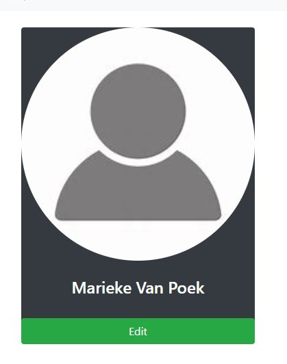
Normal user has different options:
such us: 
<h3>Profile update</h3>
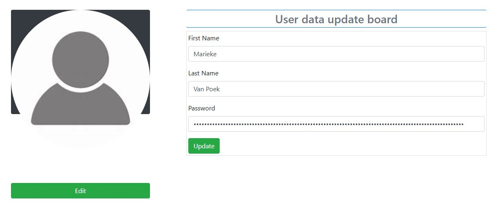
<h3>creating a post:</h3>
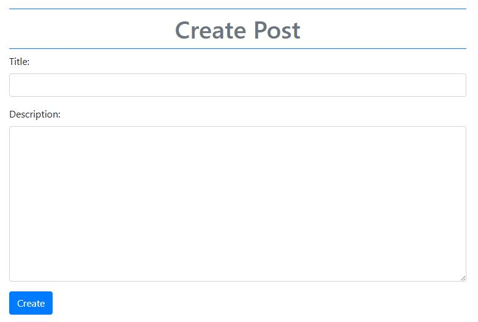 
<h3>post update:</h3>
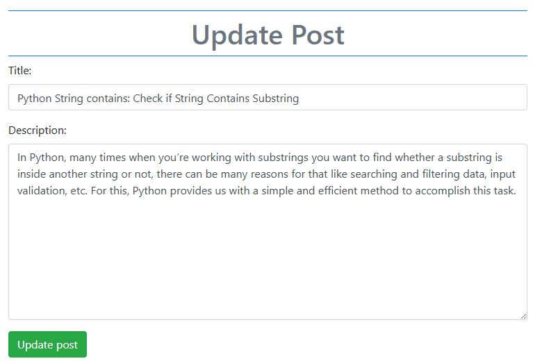
<h3>show his posts:</h3>
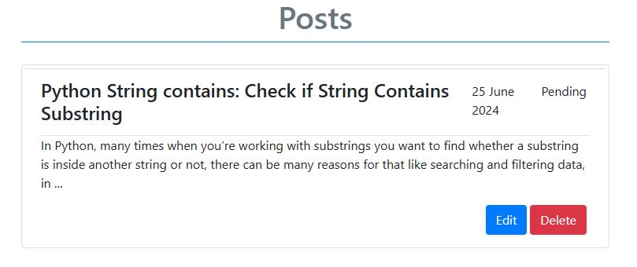
and also if s/he wants to browse other features of our system 
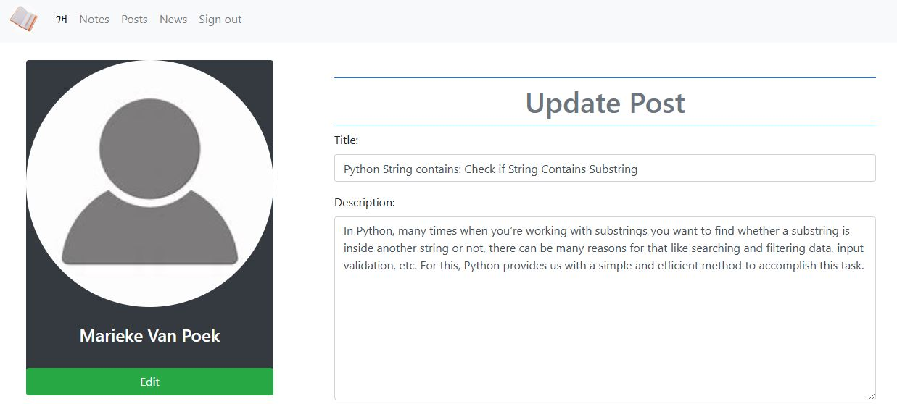
</p>


<h2>admin side</h2>
<p>
Normal user has different options:
such us: 
<h3>Access users registered in our system 
h
s/he can also banning a user from accessing our system
</h3>
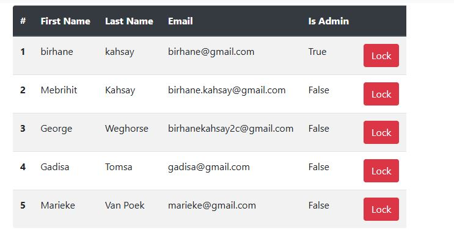
<h3>Showing posts:</h3>
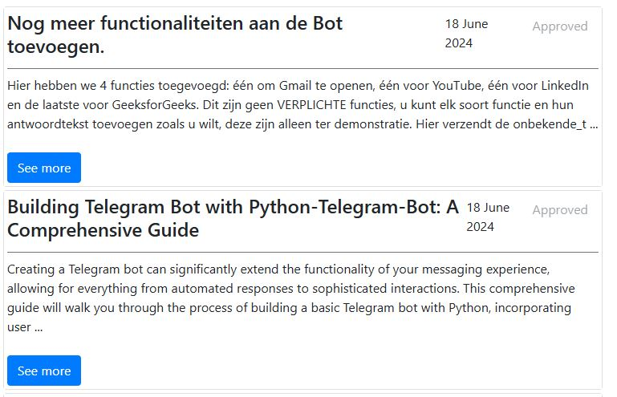 
<h3>Post status update: approved, rejecting, pending</h3>
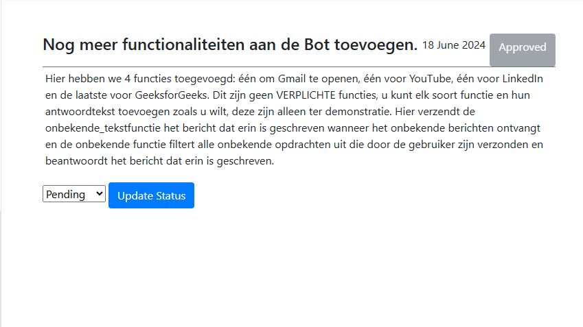
<h3>Charting:</h3>
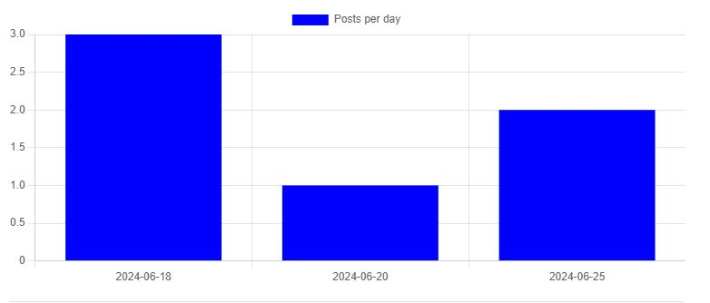
<h3>Category: </h3>
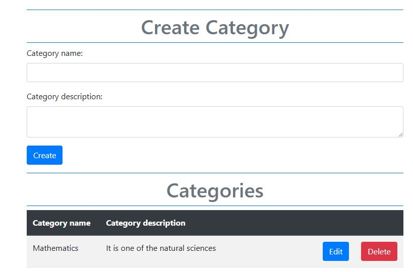
</p>

<p>
<h3>Posts or articles in our system</h3>
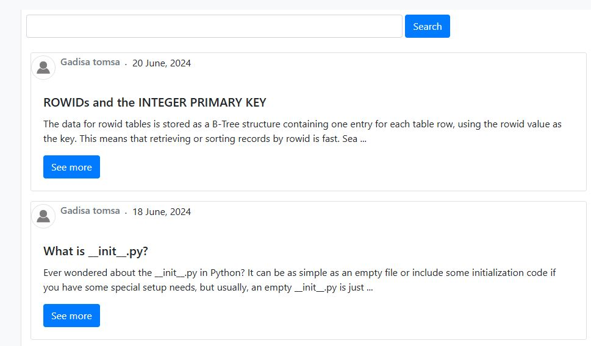
</p>

